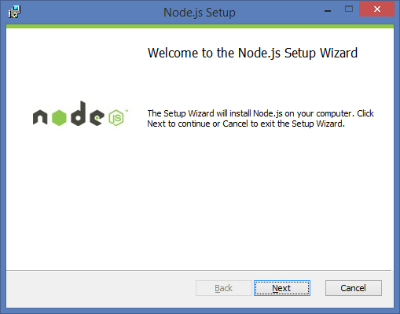

Configurando o Ambiente de Desenvolvimento
========================================
A seguir iremos apontar os pré-requisitos para executar os minicursos de desenvolvimento Web e ajudá-lo configurar seu computador. Após completar os passos desta configuração, você terá um ambiente de desenvolvimento pronto para executar os minicursos.

Configurando o computador
-----------------------

### Passo 1: Instalar o ambiente de desenvolvimento
Existem muitas ferramentas de desenvolvimento que podem te auxiliar a desenvolver sites. Temos desde editores de textos com recursos de highlight até ambientes de desenvolvimento integrados. Exemplos:

#### Editores de Texto ####
- [SublimeText](http://www.sublimetext.com/download)
- [Notepad++](https://notepad-plus-plus.org/download/v6.8.3.html)
- [Visual Studio Code](https://code.visualstudio.com/)

#### Ambientes de Desenvolvimento ####
- [Visual Studio](https://www.visualstudio.com/)
- [Netbeans](https://netbeans.org/downloads/)
- [Eclipse](https://eclipse.org/downloads/)
   
#### Ferramentas Online ####
- [Codepen](http://codepen.io/)
- [JSFiddle](https://jsfiddle.net/)
- [JS Bin](http://jsbin.com/)

Para os minicursos apresentados aqui, sugere-se que você opte por um dos ambientes de desenvolvimento citados acima por terem recurso de *build* integrado. Isso porque precisaremos testar as páginas em servidores Web. Caso se opte em usar editores de texto, como o **Visual Studio Code**, então será necessário ter um servidor Web configurado para publicar as páginas, seja local, seja remoto ou na nuvem. Para servidor Web local vamos usar o **Node.JS** (explicado logo em seguida). 

> As imagens e passos que apresentaremos aqui levarão em consideração o uso do **Visual Studio Code** e serão acessados via servidor HTTP disponibilizado pelo Node.JS.   

### Passo 2: Ter ao menos 2 browsers modernos e também o IE 

Precisamos testar o site em diferentes browsers. O ideal é termos pelo menos 2 browsers modernos, sendo um deles o Edge, e também o Internet Explorer. Se você não tem o SO do Windows, não se preocupe, você poderá testar usando máquinas virtuais disponibilizadas gratuitamente pela Microsoft (veja ["Teste seu site em diferentes versões de browsers"](http://talkitbr.com/2015/09/01/teste-seu-site-em-diferentes-versoes-de-browsers/)).   
 
### Passo 3: Clonar ou fazer download do conteúdo repositório GitHub deste curso

Os minicursos fornecem uma combinação de texto e exemplos de código. Para que você tenha acesso a toda a documentação além dos códigos de exemplo no computador, sugere-se que seja feita o download ou clonagem do repositório localmente (usando [Git](http://git-scm.com/)). a URL para clonar o repositório é `https://github.com/joaocunhaeld/interoperable-web-development.git`

### Passo 4: Baixar e configurar ferramenta de análise de sites

A Microsoft disponibiliza uma ferramenta que permite fazer análise de sites.
Contudo iremos fazer testes num site que ainda não está em produção. E para testá-lo precisaremos baixar a ferramenta Site scan da Microsoft.

1. Acessar o [repositório do Site scan no GitHub](https://github.com/MicrosoftEdge/static-code-scan).
2. Clonar ou baixar o repositório em sua máquina local.
3. [Instalar no Node.JS](https://github.com/joyent/node/wiki/Installation) ou usar um [executável pré-compilado no Windows](https://github.com/joyent/node/wiki/Installation#installing-on-windows).

	

4. Executar o Node.JS Command Prompt
5. Acessar, via linha de comando, a pasta local onde você baixou o repositório do Site Scan.
6. Executar o seguinte código:

	`npm install`

7. Se necessário, definir a variável de ambiente `PORT` para definir a porta com a qual o serviço Node.JS irá fazer bind. Por padrão a porta é 1337. Exemplo:

	`set PORT=8181`
 
8. Iniciar o serviço de Scan executando o seguinte comando, via linha de comando, na mesma pasta:

	`node app.js`

Pronto, agora é só acessar o endereço `http://localhost:8181/` para usufruir dos recursos do Site Scan no seu ambiente de desenvolvimento. 

### Passo 5: Configurar Node.JS para usar como Servidor HTTP

Agora falta ainda instalarmos o módulo do Node.JS para testarmos nosso site num Http Server.

1. Abrir linha de comando.
2. Executar o seguinte comando

`npm install http-server -g`

3. Para testar, especificar o seguinte comando:

`http-server .`

> Será iniciado um servidor HTTP por padrão na porta 8080 publicando o conteúdo da pasta onde o comando `http-server` foi executado. 

Revisão
-------

Acabamos de executar os passos necessários para ter um ambiente de desenvolvimento pronto para desenvolver e testar a aplicações Web e executar os nossos minicursos.

[Voltar para a página inicial.](http://joaocunhaeld.github.io/interoperable-web-development)