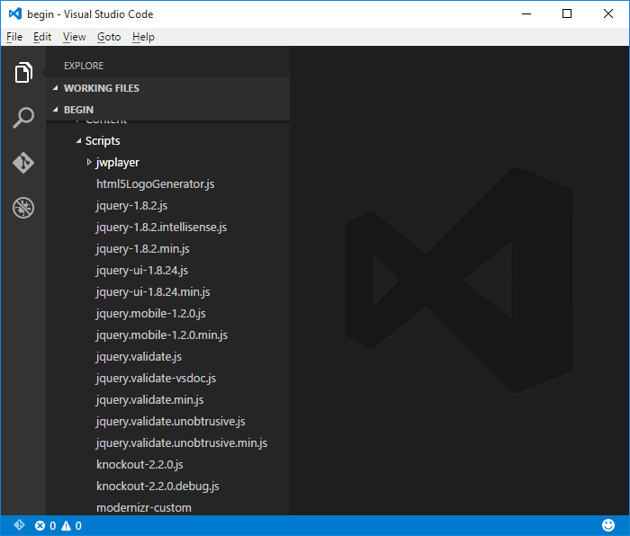
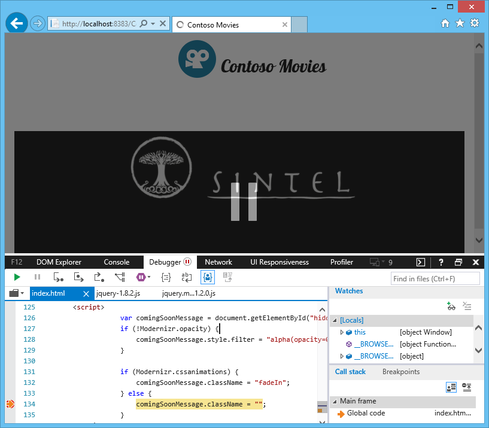

Detecção de Features
========================================
Neste minicurso iremos ver como usar detecção de features para determinar se determinado recurso é suportado pelo navegador web do usuário antes de us=alo. Isso é necessário pois existem alguns recursos que podem não estar disponíveis no navegador que o usuário está utilizando. Como não podemos e nem devemos forçar o usuário a ter um único navegador, temos que saber contornar as situações em que determinado recurso simplesmente não é suportado pelo browser do usuário.

Neste minicurso temos:

1. [Identificando e substituindo detecção de browser](#Task1)
1. [Revisão](#Review)

Atualmente existem muitas páginas que já fazem isso, mas usando detecção de browser (chamado também de user agent detection) e até de versões de browser. Porém isso não é recomendado. As boas práticas de Web Moderna pedem para que se use detecção de features.

Para executar as tarefas, vamos abrir o projeto Web. Para tanto, vamos usar o **Netbeans** e acessar a pasta [`code\begin`](./code/begin) contido no repositório.

Depois disso, execute o projeto num servidor Web local usando o próprio **Netbeans**:


> Você pode usar a ferramenta de desenvolvimento Web que desejar. Acesse a [etapa de configuração](../_setup) deste minicurso para mais detalhes.

<p name="Task1" />
##Identificando e substituindo detecção de browser

Voltando para os resultados obtidos pelo Site scan (realizado no [minicurso 1](../sitescan-rendermode/)), observe que nossa página `index.html` faz uso de detecção de browser em dois pontos:

	"browserDetection": {
      "testName": "browserDetection",
      "passed": false,
      "data": {
        "javascript": {
          "passed": false,
          "data": [
            {
              "passed": false,
              "pattern": "navigator.userAgent",
              "lineNumber": 5,
              "url": "embed"
            },
            {
              "passed": false,
              "pattern": "navigator.userAgent",
              "lineNumber": 11,
              "url": "./Scripts/jwplayer/jwplayer.js"
            }
          ]
        },
        "comments": {
          "passed": true
        }
      }
    }

Um dos pontos detectados está no nosso código HTML. O outro foi detectado no uso da biblioteca JS jwplayer. Neste momento vamos focar no nosso código HTML. 

Voltando para o código, vamos localizar os pontos que fazem uso de detecção de browser. Vamos iniciar abrindo o arquivo `index.html`. Nele encontraremos o seguinte trecho de código javascript:

	<script>
        var comingSoonMessage = document.getElementById("hidden-message");

        function isValidBrowser() {
            var myNav = navigator.userAgent.toLowerCase();
            var version;

            if (myNav.indexOf('msie') != -1) {
                version = parseInt(myNav.split('msie')[1])
                return version > 8;
            }

            return true;
        }

        if (isValidBrowser()) {
            comingSoonMessage.className = "fadeIn";
        } else {
            comingSoonMessage.className = "";
        }
    </script>

Observem que estamos verificando se o browser é o Internet Explorer para determinar se podemos ou não usar o recurso "fadeIn". Porém, mesmo que esse recurso exista nas versões mais recentes desse browser, do jeito que foi implementado, os usuários nunca conseguirão ter acesso a esse recurso no IE. Esse é apenas um caso, mas muitos outros são também comuns.

O correto é verificarmos se esse recurso existe através de *feature detection*. E existem bibliotecas que podem nos auxiliar, como é o caso do Modernizr.

Outro recurso também que pode não existir em browsers antigos é a propriedade CSS `opacity`. Para verificar o que cada browser suporta, acesse o site [CanIUse](http://caniuse.com/):


1. Vamos começar removendo a tag script que contem o Javascript que faz detecção de browser. 
2. Feito isso,  acessar o site [http://modernizr.com/download/](http://modernizr.com/download/)
2. Nesse site selecionamos os recursos que queremos. Como o recurso a ser verificado é especificamente a animação CSS3 "fadeIn" e o opacity, vamos selecionar apenas a detecção para essas features:

	 

	> Selecionar apenas as features necessárias ajuda a melhorar o desempenho do seu site.  

3. Depois de criada a build, fazer download do arquivo e colocar dentro do nosso projeto, na pasta Scripts:

	

4. Agora vamos incluir esse script na nossa página index.html. Vamos incluir no final da página, antes de fechar a tag `<body>` para não prejudicar a visualização da página pelo browser:
		
    ```
	<script src="Scripts/modernizr.custom.62681.js" type="text/javascript"></script>
    ```	

> Feito isso, ao abrirmos a página no navegador Web, o Modernizr irá verificar o suporte para as features que selecionamos a pouco. No nosso caso, a feature será CSS Transitions.
	 
7. Vamos agora incluir o script que faz detecção de feature usando informações disponibilizadas pelo script do Modernizr:

	<script>
	     var comingSoonMessage = document.getElementById("hidden-message");
	     if (!Modernizr.opacity) {                  
	          comingSoonMessage.style.filter = "alpha(opacity=0)";
	     }
             
             if (Modernizr.cssanimations) {
	          comingSoonMessage.className = "fadeIn";
	     } else {
	          comingSoonMessage.className = "";
	     }
	</script>

8. Agora vamos testar nosso site no IE e demais browsers. Usando a ferramenta do Desenvolvedor (F12), observamos que é possível verificar o funcionamento do nosso código:

	

Pronto! Se analisarmos novamente nosso site pelo Site Scan, você observará que o item de browserDetection da nossa página não estará mais lá. Somente constará o uso na biblioteca JS jwplayer:

	"browserDetection": {
      "testName": "browserDetection",
      "passed": false,
      "data": {
        "javascript": {
          "passed": false,
          "data": [
            {
              "passed": false,
              "pattern": "navigator.userAgent",
              "lineNumber": 11,
              "url": "./Scripts/jwplayer/jwplayer.js"
            }
          ]
        },
        "comments": {
          "passed": true
        }
      }
    }
  
<p name="Review"/>
##Conclusão

Aqui vimos como corrigir o site removendo detecção de browser. Você pode obter o código final desse minicurso [aqui](./code/end).

Leituras Recomendadas:

1. [Criando sites que simplesmente funcionam.](http://talkitbr.com/2015/08/27/criando-sites-que-simplesmente-funcionam/): Veja como usar detecção de features ao invés de detecção de browsers;
2. [Teste seu site em diferentes versões de browsers](http://talkitbr.com/2015/09/01/teste-seu-site-em-diferentes-versoes-de-browsers/): Veja como testar seu site em diferentes versões de browsers, desde o IE até Chrome e Firefox.

