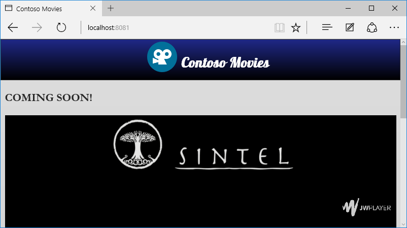
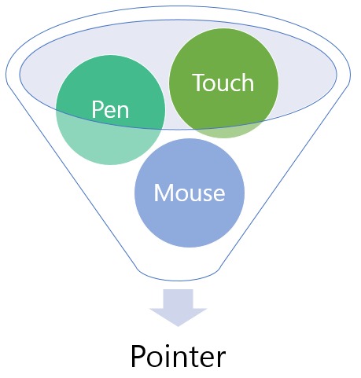
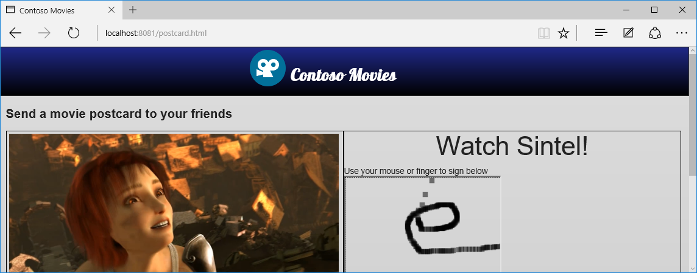

Manipulando diferentes entradas do usuário
========================================

Neste minicurso iremos continuar aperfeiçoando nosso site incluindo recurso de toque e também usando uma biblioteca para manipular este tipo de entrada de modo que funcione corretamente nos browsers de diferentes dispositivos..

Este minicurso inclui:

1. [Tratando evento de mouse e ponteiro](#Task1)
1. [Manipulando evento de entrada através do hand.js](#Task2)

Para executar as tarefas, vamos abrir o projeto Web. Para tanto, vamos usar o **Netbeans** e acessar a pasta [`code\begin`](./code/begin) contido no repositório.

Depois disso, execute o projeto num servidor Web local usando o próprio **Netbeans**:



<p name="Task1" />
## Tratando evento de mouse e ponteiro

Ao analisarmos outros problemas detectados pelo Site scan, iremos verificar que o um dos problemas encontradas diz respeito ao touch:
	
	"touch": {
      "testName": "touch",
      "passed": false
    }

Isso porque não estamos tratando de forma adequada os eventos de entrada do usuário por estarmos levando em conta somente a entrada e mouse.

Porém dispositivos de toque estão cada vez mais comuns atualmente. E por isso é tão importante considerar este tipo de entrada ao desenvolvermos aplicações Web. Para tanto temos um novo evento para considerar que é o de ponteiro e que substitui o de mouse que era comumente utilizado nas páginas Web.  
 


_Unificando caneta, toque e mouse_

Eventos de Ponteiros possuem versões correspondentes de eventos de mouse e levam em conta as diferentes formas de entradas:

- mousedown => pointerdown
- mouseenter => pointerenter
- mousemove => pointermove
- mouseup => pointerup
- ...

Vamos voltar para o nosso código e vamos

<p name="Task1" />
## Manipulando evento de entrada através do hand.js
Vamos alterar nosso site para tratar evento de mouse para permitir ao usuário fazer uma assinatura.

Essa funcionalidade será feita na página `sign.html`.

1. Abrir a página `sign.html` localizado na raiz do seu site.

2. Na marcação script vazia da página, incluir o seguinte trecho de código:

	````Javascript
	<script>
        var canvas = document.getElementById("drawSurface");
        var context = canvas.getContext("2d");
        context.fillStyle = "rgba(0, 0, 0, 0.5)";

        canvas.addEventListener("mousemove", paint, false);

        function paint(event) {
            context.fillRect(event.clientX, event.clientY, 10, 10);
        }
    </script>

	> O código acima irá desenhar um retânculo preto quando o cursor do mouse passar sobre a área do canvas. Mas e quanto as outras formas de entrada como toque e caneta? Do jeito que está, no caso do toque será desenhado somente um quadrado. 
	
3. Ao executarmos o site a abrirmos a página `postcart.html`, teremos:
		
	

Nesse estágio, vamos testar a página `sign.html` usando o site scan (URL será algo tipo `http://localhost:8383/ContosoIndustries/sign.html`). Notem que será identificado um problema relacionado com *touch*:

	"touch": {
      "testName": "touch",
      "passed": false
    }

Vamos tentar corrigir isto nas próximas etapas.

1. Voltando para a página `sign.html`, vamos localizar a tag `style` vazia e incluir a seguinte propriedade CSS:

	<!-- mark:2-4 -->
	````CSS
    <style>
        #drawSurface {
            touch-action: none; /* Disable touch behaviors, like pan and zoom */
        }
    </style>
	````
	
	> Esta propriedade instrui o canvas a não interagir com ações padrão de touque como zoom.

2. Agora, ao rodarmos a aplicação, note que o duplo toque no canvas não irá mais disparar eventos como zoom. Repare ainda que o multiplo toque não está mais sendo suportado.

3. Agora vamos incluir Javascript para registrar eventos de ponteiro ao invés de somente mouse (substituir o trecho Javascript incluído anteriormente:

	<!-- mark:6 -->
	````JavaScript
    <script>
        var canvas = document.getElementById("drawSurface");
        var context = canvas.getContext("2d");
        context.fillStyle = "rgba(0, 0, 0, 0.5)";

        canvas.addEventListener("pointermove", paint, false);

        function paint(event) {
            context.fillRect(event.clientX, event.clientY, 10, 10);
        }
    </script>
	````

4. Agora vamos testar novamente. Da forma como ficou, nosso canvas irá aceitar tanto mouse como toque quanto também caneta para desenhar.

Pronto. O problema é que até agora, estamos tratando o evento somente para alguns browsers. Ainda precisamos tratar o problema de modo que funcione nos demais navegadores Web.

Tanto que se testarmos esse site novamente no Site scan, ainda estará sendo apontado o problema no touch.
 
<p name="Task2" />
## Manipulando Entrada de Toque usando hand.js
	
Para tratar adequadamente o touch nos diferentes navegadores, podemos usar uma biblioteca Javascript chamada `hands.js`.

1. Acessar a página do [HandJS no GitHub](https://github.com/Deltakosh/handjs) e baixar a última versão da bilbioteca (download ou clone do repositório).

2. Obter o arquivo hand.js da pasta `bin` e adicionar na pasta `Scripts` da raiz do seu site.

3. Na página `sign.html`, adicionar referência para o arquivo `hand.js` dentro da tag `<head>`. 
 
	````HTML
	<script type="text/javascript" src="Scripts/hand.min.1.3.8.js"></script>
	````
	> A versão pode ser diferente daquela disponível no site no momento da escrita deste minicurso.

4. Execute novamente a aplicação. O código de assinatura irá agora funcionar em todos os navegadores e tratar corretamente os diferentes eventos de entrada do usuário.

Se testarmos agora a página sign.html, iremos verificar que o mesmo não apresenta mais o problema relacionado a touch:

	"touch": {
      "testName": "touch",
      "passed": true
    }

E para as demais páginas do site, basta incluir essa biblioteca para também resolver esse problema.

### Revisão
Neste minicurso tratamos os problemas relacionados com tratamento do evento de entrada do usuário. Este evento pode envolver tanto mouse como caneta ou até mesmo toque. Tratar adequadamente este evento garante o correto funcionamento do site nos diferentes dispositivos.
