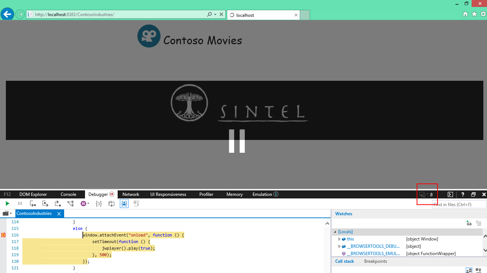
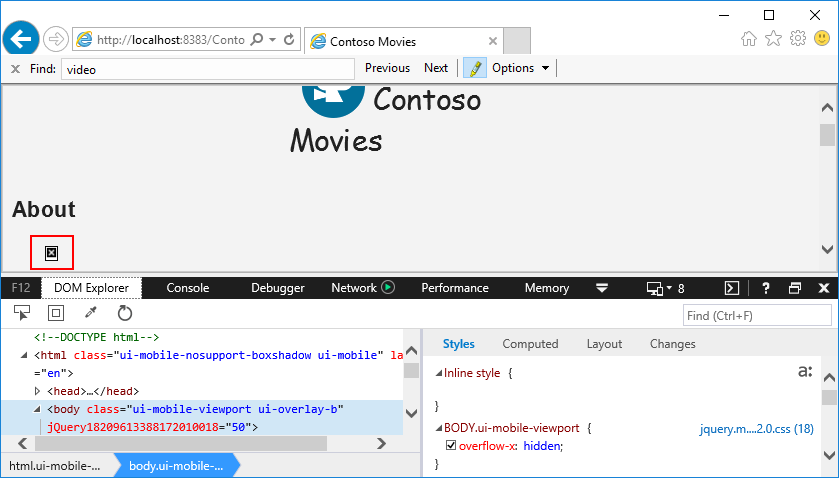
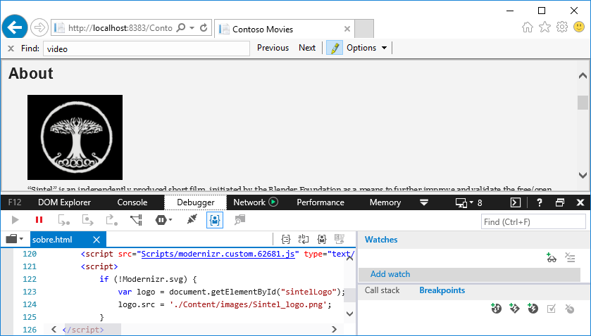

Atualizando seu site e corrigindo problemas
===========================================
Quando desenvolvemos para a Web Moderna, é inevitável que alguns recursos e propriedades que desejamos utilizar não funcionem em browsers antigos. Para contornar este problema, temos que adotar formas de atender a browsers antigos priorizando a funcionalidade. Neste caso importa para o usuário conseguir usar a funcionalidade.

Neste contexto, existem algumas propriedades que você pode abrir mão e recursos que você pode substituir por outros que permitem ainda assim que seu site funcione. E a essa estratégia da-se o nome de *Graceful Degradation*. 

Neste minicurso veremos como atualizar nosso site para suportar browsers antigos e ainda estar aderente a Web Moderna.

Este minicurso inclui:
1. [Recursos JavaScript](#Task1)
1. [Imagens SVG](#Task2)
1. [Imagens @2X](#Task3)
1. [Media Queries](#Task4)
1. [Propriedades CSS3](#Task5)
1. [Elementos HTML5](#Task6)

Neste minicurso iremos usar ténicas vistas nos minicursos anteriores, como o de [Feature Detection](../feature-detection) e [Prefixos CSS](../css-prefix) para corrigir problemas que identificamos ao [testar nosso site em diferentes browsers](../testing).

Para esta tarefa iremos usar a Ferramenta do Desenvolvedor (F12) do Internet Explorer para emular versões anteriores do IE, como o IE8. Seguem os passos para isso:

1. Abrir o projeto [Contoso Industries](code/begin) no **NetBeans**
1. Executar o projeto e abrir a página inicial no Internet Explroer.
1. Abrir a Ferramenta do Desenvolvedor pressionando a tecla F12.
1. Abrir a aba do Emulador (Emulation) e modar o **Document mode** para **8**.
	
	

	_Mudando o Document Mode para IE8_

1. O site será recarregado no emulando o IE8. 

	> Não feche a Ferramenta do Desenvolvedor. Ao fazê-lo, essa configuração será desfeita e o site volatrá a ser exibido no Document Mode padrão.

Outra opção ainda é baixar uma máquina virtual Windows contendo o IE8. Para ver como, verifique novamente nosso minicurso [de como testar nosso site em diferentes browsers](../testing).

<p name="Task1" />
#### Recursos Javascript ####
Primeiramente vamos procurar problemas relativos ao Javascript e HTML5 que não são suportados pelo IE8.

Ao executarmos a página inicial, já iremos nos deparar com um primeiro problema de visualização no IE8: o uso do 

> A função attachEvent era usada para definir código a ser executado quando ocorrer um determinado evento. O attachEvent, tornou-se obsoleto e foi totalmente removido do IE11. Além disso ele não existe em nenhum dos browsers modernos, como Microsoft Edge e Google Chrome.  As you can see, the error surfaces now that the app is running in Edge.

Após o passo 1, se executarmos nosso site iremos observar que ocorre um erro Javascript (visualizado através da ferramenta do desenvolvedor F12) relacionado com o uso da função `attachEvent`:


> **Nota 1:** Nas versões mais recentes do IE11, mesmo usando emulação para IE8, esse erro é contornado pelo browser.

> **Nota 2:** Esse é um exemplo clássico de problema Javascript quando estamos atualizando sites. A função `attachEvent` foi substituida pela função `addEventListener` nas novas versões do Javascript. Mas é muito comum encontrar o `attachEvent` nas páginas Web antigas ou que foram desenvolvidas para versões anteriores do Internet Explorer. Porém, se usamos um browser moderno ou a nova versão do IE11, o código Javascript simplesmente falha ao tentar executar a função `attachEvent`.

Para corrigir, devemos alterar o código Javascript para verificar se a função `attachEvent` está disponível. Na página `index.html`, vamos alterar o código da tag script localizado no final da tag `div` com id `mainContent`:

	````Javascript
	<script>
		if (window.attachEvent) {
            window.attachEvent("onload", function () {
                setTimeout(function () {
                    jwplayer().play(true);
                }, 500);
            });
        }
        else {
            window.addEventListener("load", function () {
                setTimeout(function () {
                    jwplayer().play(true);
                }, 500);
            });
        }
	</script>
	````	

Dessa forma, conseguiremos obter o resultado esperado em todos os casos, mesmo quando o usuário estiver usando um browser anterior do Internet Explorer que implementa somente a função `attachEvent`.



> Observe que o código de `attachEvent` foi executado quando definimos o Document Mode para IE8.

Ainda em relação ao `addEventListener`, temos outros trechos de código que são usam ele e não o `attachEvent` e podemos cair no mesmo problema citado acima. Para tanto, vamos corrigir o script da seguinte maneira:  

	<!-- mark:2,6-11 -->
	````JavaScript
        <script>
            if (window.addEventListener) {
                window.addEventListener("mobileinit", function () {
                    $.mobile.ajaxEnabled = false;
                });
            } else if (window.attachEvent) {
                window.attachEvent("mobileinit", function () {
                    $.mobile.ajaxEnabled = false;
                });
            }
        </script>
	````
> Novamente, adicionamos a condição para verificar se o `addEventListener` é suportado antes de usá-lo. Caso não seja suportado, então usamos a função antiga `attachEvent` para registrar o manipulador de evento.

> Fazer a alteração acima em todas as páginas html do nosso site em que houver o uso do `addEventListener`.

Em seguida, vamos tratar o Javascript que carrega o vídeo:

1. Vamos abrir a página `index.html` e encontrar a tag `<video>`. Vamos atualizar o código para que pareça conforme definido abaixo:

	<!-- mark:2 -->
	````HTML
		 <video id="promoVideo" width="100%" controls src="http://wams.edgesuite.net/media/SintelTrailer_MP4_from_WAME/sintel_trailer-1080p_3400.mp4">
			  <div id="myElement">Loading the player...</div>
		 </video>

	````
	
	> A marcação `<video>` foi incluída no HTML5. Observe que esse código provê um conteúdo alternativo no caso da marcação <video> não ser suportada.

1. Ainda na página `index.html`, copie o seguinte trecho Javascript, logo antes da primeira tag `script` já definida na página:

	````JavaScript
	<script type="text/javascript">
		 if (!window.addEventListener) {
			  jwplayer("myElement").setup({
					file: "http://wams.edgesuite.net/media/SintelTrailer_MP4_from_WAME/sintel_trailer-1080p_3400.mp4",
					width: "100%",
					aspectratio: "16:9",
					primary: "flash"
			  });
		 }
	</script>
	````

1. Vamos agora incluir o script do flashplayer na nossa página, no fim da marcação `<head>`:

	````JavaScript
    	<script src="./Scripts/jwplayer/jwplayer.js"></script>
	````

1. Vamos tentar agora rodar nosso site de novo. Quando abrimos a p[agina no IE8, observe que ser[a carregado o jwplayer.

	The website will reload, emulating IE8. Notice that now there are no errors thrown, and after a few of seconds the video starts playing. 

	

	_Website displays in IE8 without loading errors_

1. Play around with the page, and click the movie title to display the synopsis.
 
	Notice you will get an error since the [classList property](https://developer.mozilla.org/en-US/docs/Web/API/element.classList) is not available in IE8 (or IE9). As it stands, css animations are not supported either. 

	
	_Error Message when clicking the movie title_

	You will now update the code to use _Feature Detection_, as you did in the [Feature Detection lab](../edge-mode-and-feature-detection). Additionally, as part of graceful degradation, the fix will arrive to the same end result (semi-transparent title and synopsis displayed) but without the nice slideOut animation available in IE8 and without using the _classList_ property.

1. Dismiss the error message dialog box and stop debugging.

1. Open **Index.cshtml** and scroll until you find a script tag with the same code displayed at the error point:

	````JavaScript
	<script>
		 var wrapper = document.querySelector(".wrapper");
		  wrapper.onclick = function () {
				wrapper.classList.toggle("animation");
		  };
	</script>
	````

1. Update the code so it looks as follows:
	<!-- mark:3-4,7-20 -->
	````JavaScript
	<script>
		 var wrapper = document.querySelector(".wrapper");
		 if (Modernizr.cssanimations) {
			  wrapper.onclick = function () {
					wrapper.classList.toggle("animation");
			  };
		 } else {
			  wrapper.onclick = function () {
					var synopsis = document.getElementById("synopsis");
					var title = document.getElementById("movietitle");
					if (synopsis.style.display != "block") {
						 synopsis.style.left = "0px";
						 synopsis.style.display = "block";
						 title.style.filter = "progid:DXImageTransform.Microsoft.Alpha(Opacity=10)";
					} else {
						 synopsis.style.display = "none";
						 title.style.filter = "progid:DXImageTransform.Microsoft.Alpha(Opacity=100)";
					}
			  };
		 }
	</script>
	````

	The code is now using _Modernizr.cssanimations_ to determine whether animations are available. In the _else_ block there is an alternate code for the _onclick_ event handler function. This alternative function manually displays the synopsis by setting the display mode and location and sets the opacity for the title using the filter property (the way it was done in IE8).

1. Press **F5** to start debugging. Again, after IE is launched, change IE to emulate IE8 (press **F12** to open the Developer Tools and then **Ctrl+8** to switch to the Emulator tab, where you will change the **Document mode** to **8**).

	The website will reload, emulating IE8. Notice that now when you click the movie title header no errors are thrown: the opacity of the title changes and the synopsis is displayed. If you click again, the synopsis is hidden and the title is shown in black. In short, the same end result is achieved albeit without the animation. 

	

	_Website running in IE8 with the fallback for the synopsis_

1. Click the **About** button in the navigation bar.

	The About page loads. Notice the logo is not being displayed. You will learn why and how to fix it in the next steps.

1. Stop debugging.

<p name="Task2" />
#### Imagens SVG ####
[SVG](http://www.w3schools.com/svg/svg_intro.asp) (Scalable Vector Graphics) é uma imagem no formato de vertor para gráficos bidimensionais com suporte a interatividade e animação. As imagens SVG são escaláveis e não perdem qualidade quando é feito zoom ou redimensionamento. Como são definidas através de XML, elas podem ser criadas e editadas por qualquer editor de texto. Essas vantagens assim como aderência a padrões tornem o SVG uma alternativa atrativa. Contudo, a falta de suporte pelos browsers limitou seu uso na Web. Uma forma de contornar esta limitação é fornecer, para esses browsers que não suportam XVG, imagens equivalentes mas com formato tradicional.

Vamos ver agora como fazer isso:

1. Abrir a página sobre.html.
2. Observe que temos o seguinte código na página:

	

3. Quando tentamos visualizar essa página emulando o IE8, veja que o logo não é mostrado.
                    
	

4. Para corrigir isso, vamos usar o Modernizr para verificar se o SVG é suportado ou não. Porém o script que geramos anteriormente não verificar SVG (só incluímos no nosso script Modernizr a verificação de CSS Animations e Opacity).
5. Vamos voltar então para o site mo [Modernizr](http://modernizr.com) e selecionar a nossa build os recursos CSS Animations, opacity e agora o SVG. 
	> Reveja como fazer isso no nosso outro [minicurso de detecção de features](../feature-detection).
	> 
	> Vamos pegar o conteúdo Javascript gerado pelo Modernizr e substituir aquele que já tinhamos adicionado na nossa pasta Script (lembre-se de manter o mesmo nome de arquivo).   
6. Agora vamos incluir o seguitne Javascript no final da nossa página sobre.html (antes de fechar a tag <body>):

	````JavaScript
	<script>
		 if (!Modernizr.svg) {
			  var logo = document.getElementById("sintelLogo");
			  logo.src = './Content/images/Sintel_logo.png';
		 }
	</script>
	````
	
	> Lembrar de incluir também o Javascript do Modernizr.

7. Acessando novamente a página, observe que o logo irá aparecer no IE8.

	

<p name="Task3" />
#### @2X images ####
Com os novos dispositivos e telas de retina, as imagens normalmente tem um aspecto granular e de baixa qualidade. A solução adotada nos sites modernos é adotar duas versões de imagens: uma versão normal e outro "2x" que é muito maior. Esta versão 2x precisa ser exibida somente para dispositivos com tela de retina..

Para detectar dispositivos de retina e então fornecer imagens "2x", podemos usar o media query (iremos ver mais detalhes de media queries no outro [minicurso de design responsivo](../mobile-first-design). 

Neste caso podemos também usar a ferramenta de desenvolvimento (F12) do Google Chrome pois ele permite emular diferentes resoluções de tela (ver mais detaques [aqui](https://developer.chrome.com/devtools/docs/device-mode#screen-emulator)).

1. Abrir o arquivo contato.html.

1. Atualizar a marcação `style` e adicone media query para fornecer imagem de alta resolução::
	
	<!-- mark:14-19 -->
	````CSS
	<style>
		 .contact {
			  padding: 5px 10px 15px 0px;
			  font-family: Georgia;
			  font-size: 16px;
			  text-align: justify;
		 }

		 .highqualityimage {
			  background: url("/content/images/sintel_logo.png") no-repeat;
			  height: 140px;
		 }

		 @@media(-webkit-min-device-pixel-ratio: 2), (min-resolution: 192dpi) {
			  .highqualityimage {
					background: url("./Content/images/sintel_logo@2x.png") no-repeat;
                    background-size: 140px;
			  }
		 }
	</style>
	````

1. Usando o Google Chrome e a ferramenta do desenvolvedor para emular dispositivo de alta resolução, vamos testar nosso site:

	

	> Perceba no código CSS ao lado que a imagem definida para a página é a 2x.

<p name="Task4" />
#### Media Queries ####
As media queries foram introduzidas no CSS3 e permitem construir web sites responsivos. Porém, elas não são suportadas em browsers antigos como o IE8. Se você está desenvolvendo mobile-first, que é a maneira mais recomendada para construir sites, você deve ter que contornar essa limitação.

Para tanto, temos duas opções. 

* Usar bibliotecas Javascript, como o [Respond.js](https://github.com/scottjehl/Respond), para adicionar suporte a media queries no IE8. Seu código CSS continua igual e a biblioteca faz o trabalho pra você. Para usar, podemos incluir o seguinte HTML nas nossas páginas:
	
	````HTML
	<!--[if lt IE 9]>
		 <script src="http://cdnjs.cloudflare.com/ajax/libs/respond.js/1.1.0/respond.min.js"></script>
	<![endif]-->
	````

* Usar condicionais no CSS. Neste caso o CSS é adaptado para IE8.
 
	Folhas de estilo condicionais são escritas especificamente para um determinado browser (por exemplo, IE8) que é referenciado na expressão de condição. Segue exemplo:

	````HTML
	<!--[if (lt IE 9) & (!IEMobile)]>
		 <link href="ie8.css" rel="stylesheet">
	<![endif]-->
	 
	<!--[if (gte IE 9) | (IEMobile)]><!-->
		 <link href="style.css" rel="stylesheet">
	<!--<![endif]-->
	````

	[Este artigo](http://seesparkbox.com/foundry/structuring_and_serving_styles_for_older_browsers) fornece uma abordagem interessante para gerar automaticamente folhas de estilo para IE8 livres de Media Queries. Para tanto, ele usa mixins e variáveis.

Pronto! O próximo passo agora é usar o elemento `<video>` do HTML5 e tratar o caso em que o elemento não é suportado pelo browser.

<p name="Task5" />
#### Propriedades CSS3
Muitas vezes precisamos ou queremos usar um recurso CSS que ainda não está disponível em todos  browsers. Ou ainda, está disponível em apenas alguns browsers. Neste caso, quando o recurso ainda não é padrão, podemos usar os chamados prefixos CSS que permitem usar recursos nos diferentes browsers.  

> Nota: Tratamos desse assunto no [minicurso cd prefixos CSS](../css-prefix).

Quando estamos trabalhando no nosso site para suportar browsers antigos, precisamos estar atentos para não causar um efeito indesejado ou até causando um efeito contrário. No nosso exemplo do site Contoso, há um cabeçalho nas páginas que deveria ter uma cor com efeito gradiente indo do azul ao preto. Este gradiente não é mostrado no IE8. Ao contrário, é mostrada somente uma cor chapada. Para corrigir isso vamos ao código:

1. Abrir o arquivo `Content/Site.css`
2.Encontrar a regra CSS do cabeçalho: 

	````CSS
	header[role=banner] {
	    background: linear-gradient(#1f2887, #000000);
	}
	````

1. Atualizar as regras da seguinte maneira:

	````CSS
	header[role=banner] {
	    background: #1f2887;
	    background: -webkit-linear-gradient(#1f2887, #000000);
	    background: -o-linear-gradient(#1f2887, #000000);
	    background: -moz-linear-gradient(#1f2887, #000000);
	    background: linear-gradient(#1f2887, #000000);
	}
	````

	>Nesta regra estamos definindo o background padrão somente caso o gradiente não seja suportado. Lembre-se de especificar o gradiente usando os prefixos, conforme visto no nosso outro minicurso. 

	

	>Para testar usamos o IE9 pois o IE8 não suporta a marcação HTML5 `<header>`. Mas essa limitação será tratada a seguir.

<p name="Task6" />
#### Elementos HTML5
O [HTML5](http://www.w3schools.com/html/html5_intro.asp) introduziu novos elementos HTML. Alguns deles já vimos neste minicurso (imagem SVG, marcação <video>) e vimos como fornecer uma alternativa para browsers antigos. Alguns dos elementos introduzidos são os elementos semânticos _\<header>_, _\<footer>_, _\<article>_ e _\<section>_.

Porém, conforme comentado a pouco, o IE8 não suporta essas marcações. A seguir iremos ver como lidar com essas limitações.

1. Abrir o arquivo `index.html`.
2. Localizar na marcação `<body>` o local onde usamos a marcação `<header>`. Você encontrará este trecho de código:

	<!-- mark:3,15 -->
	````HTML
	    <body>
	        <div data-role="page" data-theme="b">
	            <header data-role="header">
	                <div class="header-container">
	                    
	                    <div class="title">Contoso Movies</div>
	                </div>
	            </header>   
			...
			</div>
	   </body>
	````

	> Como podemos ver, o cabeçalho foi feito usando a marcação HTML5 `header` que não é suportada pelo IE8. 

3. Vamos habilitar o HTML5 via Javascript usando a biblioteca html5shiv. Para tanto, vamos incluir essa biblioteca no `<head>` da nossa página:

	````HTML
		<!--[if lt IE 9]>
		<script src="https://raw.githubusercontent.com/aFarkas/html5shiv/master/dist/html5shiv.min.js"></script>
        <script src="https://raw.githubusercontent.com/aFarkas/html5shiv/master/dist/html5shiv-printshiv.min.js"></script>       
		<![endif]-->
	````

	> Estamos incluindo o _shiv_ usando a condição de que o browser seja IE8 ou anterior. 

	> Lembre-se de adicionar em todas as págians HTML do nosso site que usando a marcação `<head>` 

Pronto! Agora podemos testar novamente nosso site no IE8 para verificar a cor de fundo do cabeçalho.

##Summary##
In this lab you have learned about different ways of testing websites that don't involve a lab with physical machines or devices that you manually interact with. Also, you have seen how to change your website to gracefully support older versions of different browsers.
